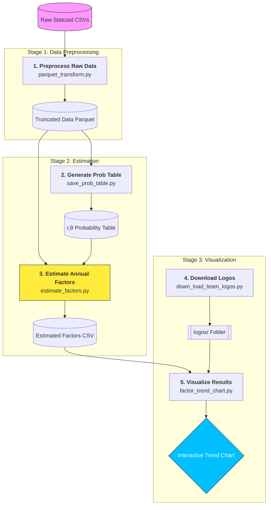

# MLB Park Factor and Defense Factor Analysis

## Project Overview
This repository provides a quantitative framework for analyzing Major League Baseball (MLB) performance data. By leveraging Statcast physics data (exit velocity and launch angle), the project calculates **Park Factors** and **Defense Factors** using a grid-based empirical distribution and Weighted Least Squares (WLS) regression.

## Key Features
- **Grid-Based Binning**: Converts continuous Statcast data into discrete $(r, \theta)$ grid points for stable empirical probability estimation.
- **Empirical Distribution**: Calculates the baseline expectancy for events (Singles, Doubles, etc.) across the entire MLB dataset.
- **Weighted Regression Analysis**: Simultaneously estimates Park and Defense effects while accounting for game-level sample sizes (Balls in Play).
- **Dynamic Metrics**: Configurable weights to calculate factors for different metrics like SLG, wOBA, or custom indices.
- **Pro-Level Visualization**: Generates trend charts integrated with official MLB team logos and branding colors.

## Tech Stack
- **Language**: Python 3.11+
- **Data Analysis**: `pandas`, `numpy`
- **Statistics**: `statsmodels`, `scipy`
- **Visualization**: `plotly`, `matplotlib`, `tqdm`

## Repository Structure
```text
├── data/                      # Raw Statcast CSVs and processed Parquet files
├── logos/                     # Downloaded MLB team logos
├── commands/                   # Shell scripts for automated pipeline execution
│   ├── parquet_transform.sh   # Step 1: Trigger data cleaning and grid binning
│   ├── save_prob_table.sh     # Step 2: Trigger probability table generation
│   ├── estimate_factors.sh    # Step 3: Trigger WLS regression analysis
│   └── factor_trend_chart.sh  # Step 4: Trigger visualization generation
├── scripts/                       # Core Python implementation
│   ├── parquet_transform.py   # Data cleaning and (r, theta) grid binning
│   ├── save_prob_table.py     # Empirical probability distribution calculation
│   ├── estimate_factors.py    # Weighted Least Squares regression for factors
│   ├── factor_trend_chart.py  # Trend visualization with team logos and colors
│   ├── down_load_team_logos.py# Utility to scrape and save team assets
│   └── utils.py               # Shared Config classes and data helpers
├── results/                   # Exported factor CSVs and Plotly HTML/PNG charts
├── requirements.txt           # Project dependencies
```

##  Getting Started

Follow these instructions to set up the project on your local machine.

### Prerequisites

Before you begin, ensure you have the following installed:
* **Python 3.11 or higher**: [Download Python](https://www.python.org/downloads/)
* **Git**: [Download Git](https://git-scm.com/downloads)
* **Pip**: Usually comes installed with Python.

### Installation

1. **Clone the repository:**
   Open your terminal or command prompt and run:
   ```bash
   git clone https://github.com/DanielYan0224/factor-and-defense-factor.git
   cd factor-and-defense-factor
   ```

2. **Create the project environment:**
    ```bash
   conda create -n [your_project_name] python=3.11 -y
   ```

3. **Install the required packages:**
    ```bash
   pip install -r requirements.txt
   ```

### Analysis Pipeline Flowchart



## Pipeline Execution
Follow these steps in order to process the data and generate the final factor estimates.

### 1. Preprocess Raw Data
Converts raw Statcast CSV files into a consolidated Parquet format and assigns each hit to a specific $(r, \theta)$ grid bin.
   ```bash
   bash commands/parquet_transform.sh
   ```

### 2. Generate Probability Table
Calculates the league-wide empirical probability for every grid bin to establish "expected" outcome baselines.
   ```bash
   bash commands/save_prob_table.sh
   ```

### 3. Estimate Annual Factors
Runs the weighted regression model to calculate Park and Defense factors for each team/year.
   ```bash
   bash commands/estimate_factors.sh
   ```

### 4. Download Team Logos
Scrapes and saves official MLB team logos to the local logos/ directory for use in charts.
   ```bash
   python scripts/down_load_team_logos.py
   ```

### 5. Visualize Results
Generates interactive Plotly charts showing the trend of factors over time, including team logos.
   ```bash
   bash commands/factor_trend_chart.sh
   ```